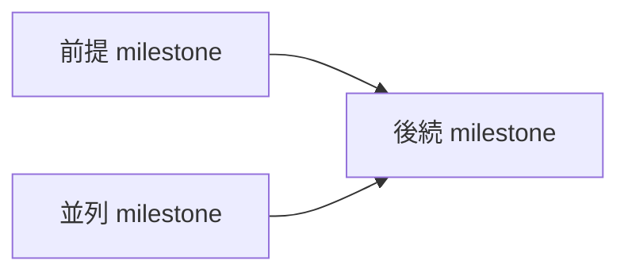

# Linear Milestone 書き込み

## 目的

Linear Project milestone の作成・更新だけを担当する。個別 issue や Project 本体の変更は別 skill に任せる。

## 境界

- fetch 系 skill ではない。read-only の取得だけなら `fetch-linear-materials` を使う。
- 個別 issue の作成・更新は `write-linear-issue` を使う。
- Project 本体の作成・更新は `write-linear-project` を使う。
- ユーザーが明示的に依頼していない書き込みは行わない。
- token、OAuth code、API key、cookie を受け取らない・保存しない。
- vault の Project note を自動更新しない。

## Linear MCP の制約（Codex / Claude 共通で確認済み）

- milestone には単独の URL が存在しない。Linear MCP の `get_milestone` / `save_milestone` はどちらも `url` を返さない。実行後に link を返す場合は、対象 Project の URL を返し、「milestone 自体の単独 URL はない」旨を明記する。
- milestone を削除・archive する tool は存在しない（`delete_milestone` に相当する tool がない）。削除したい場合は Linear の Web UI から手動操作するようユーザーに案内する。自動では止められないので、代替手段（コメントで無効化を明記するなど）で誤魔化さない。
- issue（`save_issue` の `state`）と Project（`save_project` の `state`）は `Canceled` 状態への変更はできるが、これは Linear 上の soft archive であり、完全な delete ではない。完全に消す場合も Web UI が必要。

## 事前確認

書き込み前に、次を特定する。

- 操作: create / update / reorder / date change など。
- 対象: Linear Project URL / Project name と milestone name。新規作成なら Project と name。
- 変更内容: name、description、target date、status、order、関連 issue。
- 依存関係: 前提になる milestone、後続 milestone への影響、target date の制約。
- 理由: なぜこの変更が必要か。

対象、変更内容、理由のどれかが曖昧な場合は、実行前に短く確認する。

## Linear Method の参照

Milestone の作成・更新前に、必要に応じて `.agents/references/linear-method-principles.md` の `Milestone の原則` と `レビュー観点` を読む。前後関係がある milestone では、依存関係、後続への影響、target date の矛盾も確認する。依存関係が複数ある場合は、Mermaid などで並列に進められる milestone と順番が必要な milestone を図式化することを検討する。

## Milestone description テンプレート

新規 milestone 作成、または description を大きく更新する場合は、次の大項目を使う。分からない項目は無理に埋めず、`未確定` として残すか、実行前に確認する。

```markdown
## 目的

-

## アウトカム

-

## 完了条件

-

## 対象範囲

-

## 対象外

-

## 依存関係

-



## 重要リンク

-

## 補足

-
```

## 実行手順

1. 利用可能な Linear connector / MCP / CLI を確認する。
2. 対象 Project と milestone が正しいか read-only で確認する。
   - この時点で `401: Reauthentication required`、`Unauthorized`、`Authentication required`、`oauth_token_invalid_grant` などが返った場合は、draft 作成や書き込みへ進まず、再認証を依頼する。
3. 実行前に draft を提示する。
4. ユーザーが明示的に承認した場合だけ書き込む。
5. 実行後、変更した milestone、変更内容、Linear link（milestone 自体の URL がないため、対象 Project の URL）を返す。

## Draft フォーマット

```markdown
## Linear milestone 書き込み draft

- 操作:
- 対象 Project:
- 対象 milestone:
- 変更内容:
- Description:
- 理由:
- 実行後に返す link:

この内容で Linear に書き込んでよいか確認してください。
```

## 参考

- `.agents/references/linear-method-principles.md`

## 返答フォーマット

```markdown
## Linear milestone 書き込み結果

- 結果: 成功 / 失敗 / 未実行
- 対象 Project:
- 対象 milestone:
- 変更内容:
- Link: 対象 Project の URL（milestone 自体の単独 URL は Linear 上に存在しない）
- 補足:
```

## 失敗時

認証切れ、権限不足、対象不明、Project 不明、validation error の場合は、追加書き込みを止めて次を返す。

認証切れの場合は、別の Linear tool、コメント追記、CLI などで代替書き込みを続けない。ユーザーが再認証してから同じ対象を再試行する。

- 失敗した操作。
- 対象。
- 失敗理由。
- ユーザーが次に行うこと。
- 再試行条件。
