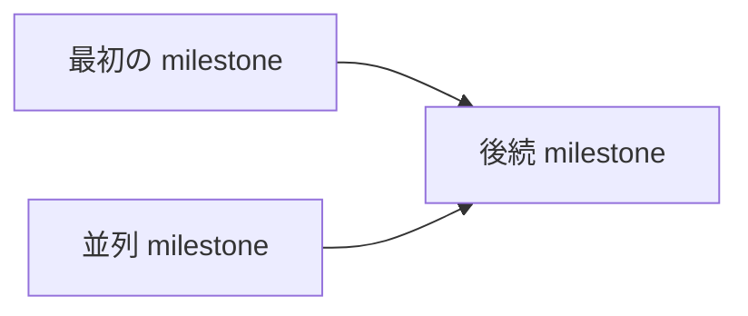

# Linear Project 書き込み

## 目的

Linear Project の作成・更新だけを担当する。Project に紐づく個別 issue や milestone の変更は別 skill に任せる。

## 境界

- fetch 系 skill ではない。read-only の取得だけなら `fetch-linear-materials` を使う。
- 個別 issue の作成・更新は `write-linear-issue` を使う。
- Project milestone の作成・更新は `write-linear-milestone` を使う。
- ユーザーが明示的に依頼していない書き込みは行わない。
- token、OAuth code、API key、cookie を受け取らない・保存しない。
- vault の Project note を自動更新しない。

## 事前確認

書き込み前に、次を特定する。

- 操作: create / update / archive / status change など。
- 対象: Linear Project URL / Project name。新規作成なら workspace、team、name。
- 変更内容: name、description、status、lead、members、teams、roadmap、target date、link。
- 理由: なぜこの変更が必要か。

対象、変更内容、理由のどれかが曖昧な場合は、実行前に短く確認する。

## Linear Method の参照

Project の作成・更新前に、必要に応じて `.agents/references/linear-method-principles.md` の `Project の原則` と `レビュー観点` を読む。milestone が複数ある場合は、Project description で全体の流れ、並列に進められる範囲、依存関係が分かるか確認する。

## Project description テンプレート

新規 Project 作成、または description を大きく更新する場合は、次の大項目を使う。分からない項目は無理に埋めず、`未確定` として残すか、実行前に確認する。

```markdown
## 背景

-

## 目標

-

## 対象範囲

-

## 対象外

-

## 成功条件

-

## マイルストーン

-



## 重要リンク

-

## 補足

-
```

## 実行手順

1. 利用可能な Linear connector / MCP / CLI を確認する。
2. 対象 Project または作成先 team が正しいか read-only で確認する。
   - この時点で `401: Reauthentication required`、`Unauthorized`、`Authentication required`、`oauth_token_invalid_grant` などが返った場合は、draft 作成や書き込みへ進まず、再認証を依頼する。
3. 実行前に draft を提示する。
4. ユーザーが明示的に承認した場合だけ書き込む。
5. 実行後、変更した Project、変更内容、Linear link を返す。

## Draft フォーマット

```markdown
## Linear Project 書き込み draft

- 操作:
- 対象:
- Team / Workspace:
- 変更内容:
- Description:
- 理由:
- 実行後に返す link:

この内容で Linear に書き込んでよいか確認してください。
```

## 参考

- `.agents/references/linear-method-principles.md`

## 返答フォーマット

```markdown
## Linear Project 書き込み結果

- 結果: 成功 / 失敗 / 未実行
- 対象:
- 変更内容:
- Link:
- 補足:
```

## 失敗時

認証切れ、権限不足、対象不明、team 不明、validation error の場合は、追加書き込みを止めて次を返す。

認証切れの場合は、別の Linear tool、コメント追記、CLI などで代替書き込みを続けない。ユーザーが再認証してから同じ対象を再試行する。

- 失敗した操作。
- 対象。
- 失敗理由。
- ユーザーが次に行うこと。
- 再試行条件。
